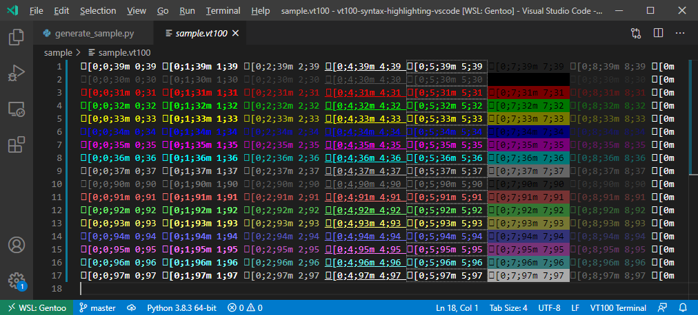

# VT100 Color and Style Highlighting for VS Code

## Features

This extension provides highlighting for VT100 color escape sequences.
Below is a screenshot how the highlighted sample file might look by applying this plugin.
The highligh colors and styles can be customized via the global or project configuration.
Select the file type "VT100 Terminal" on the lower right corner to enable highlighting of a file.



## Requirements

Typescript for plugin development.
This extension does not need any other dependencies.

## Extension Settings

Edit the global or project local VS Code configuration and apply your custom colors.
The configuration values shown below are the defaults set by the plugin.

```json
{
    // Associate the VT100 extension with *.log files if you want to
    // "files.associations": {
    //     "*.log": "vt100"
    // },

    // Default foreground color and inverted default foreground color
    "vt100.foreground-color-default": { "color":  "#FFFFFF" },
    "vt100.foreground-color-inverted": { "color":  "#000000" },

    // Standard foreground colors
    "vt100.foreground-color-black": { "color":  "#555555" },
    "vt100.foreground-color-red": { "color":  "#FF0000" },
    "vt100.foreground-color-green": { "color":  "#00FF00" },
    "vt100.foreground-color-yellow": { "color":  "#FFFF00" },
    "vt100.foreground-color-blue": { "color":  "#0000FF" },
    "vt100.foreground-color-magenta": { "color":  "#FF00FF" },
    "vt100.foreground-color-cyan": { "color":  "#00FFFF" },
    "vt100.foreground-color-light-gray": { "color":  "#BBBBBB" },
    "vt100.foreground-color-dark-gray": { "color":  "#777777" },
    "vt100.foreground-color-light-red": { "color":  "#FF7777" },
    "vt100.foreground-color-light-green": { "color":  "#77FF77" },
    "vt100.foreground-color-light-yellow": { "color":  "#FFFF77" },
    "vt100.foreground-color-light-blue": { "color":  "#7777FF" },
    "vt100.foreground-color-light-magenta": { "color":  "#FF77FF" },
    "vt100.foreground-color-light-cyan": { "color":  "#77FFFF" },
    "vt100.foreground-color-white": { "color":  "#FFFFFF" },

    // Default background color and inverted default background color
    "vt100.background-color-default": {},
    "vt100.background-color-inverted": {},

    // Standard background colors
    "vt100.background-color-black": { "backgroundColor":  "#000000" },
    "vt100.background-color-red": { "backgroundColor":  "#770000" },
    "vt100.background-color-green": { "backgroundColor":  "#007700" },
    "vt100.background-color-yellow": { "backgroundColor":  "#777700" },
    "vt100.background-color-blue": { "backgroundColor":  "#000077" },
    "vt100.background-color-magenta": { "backgroundColor":  "#770077" },
    "vt100.background-color-cyan": { "backgroundColor":  "#007777" },
    "vt100.background-color-light-gray": { "backgroundColor":  "#666666" },
    "vt100.background-color-dark-gray": { "backgroundColor":  "#222222" },
    "vt100.background-color-light-red": { "backgroundColor":  "#773333" },
    "vt100.background-color-light-green": { "backgroundColor":  "#337733" },
    "vt100.background-color-light-yellow": { "backgroundColor":  "#777733" },
    "vt100.background-color-light-blue": { "backgroundColor":  "#333377" },
    "vt100.background-color-light-magenta": { "backgroundColor":  "#773377" },
    "vt100.background-color-light-cyan": { "backgroundColor":  "#337777" },
    "vt100.background-color-white": { "backgroundColor":  "#AAAAAA" },

    // VT100 attributes
    "vt100.attribute-bold": { "fontWeight": "bold" },
    "vt100.attribute-dim": { "opacity": "0.7" },
    "vt100.attribute-underlined": { "textDecoration": "underline solid" },
    "vt100.attribute-blink": { "border": "1px dotted #FFFFFF77" },
    "vt100.attribute-hidden": { "opacity": "0.3" },

    // VT100 escape sequences
    // Do not apply additional styling to escape sequences (default)
    "vt100.escape-sequence": { }

    // Make escape sequences white and fully visible
    // "vt100.escape-sequence": { "color": "#FFFFFF !important", "opacity": "1.0 !important"  }

    // Make escape sequences invisible
    // "vt100.escape-sequence": { "opacity": "0.0 !important" }
}
```

## Test with Example

Use the python program below to generate a sample file which contains VT100 escape sequences.

```python
#!/bin/env python3

FGCOLORS = [
    39,
    30, 31, 32, 33, 34, 35, 36, 37,
    90, 91, 92, 93, 94, 95, 96, 97
]
BGCOLORS = [
    49,
    40, 41, 42, 43, 44, 45, 46, 47,
    100, 101, 102, 103, 104, 105, 106, 107
]
ATTRIBUTES = [ 0, 1, 2, 4, 5, 7, 8 ]

for bgColor in BGCOLORS:
    for fgColor in FGCOLORS:
        line = ""
        for attribute in ATTRIBUTES:
            style = f"{attribute};{fgColor};{bgColor}"
            line += f"\x1b[0;{style}m {style}"
        line += "\x1b[0m"
        print(line)
    print()
```

Run the program with `python3 generate_sample.py > sample.vt100`.
The output looks similar to the image shown below on a terminal.


