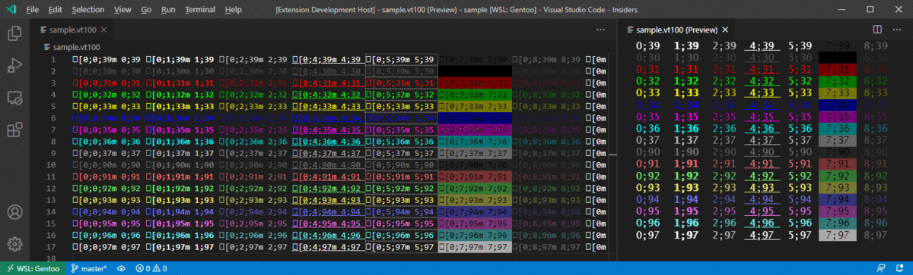
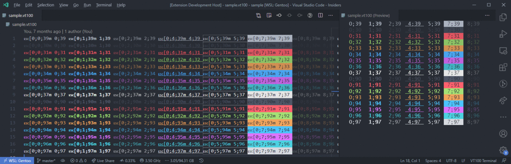
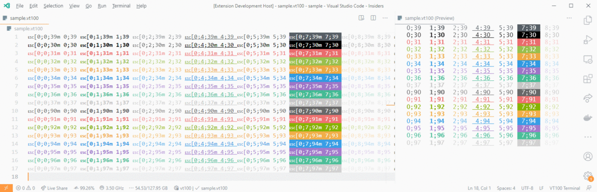
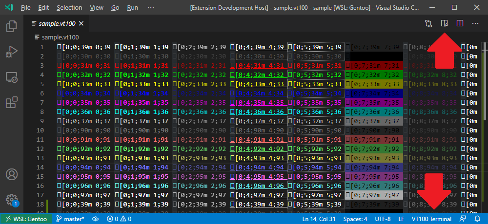
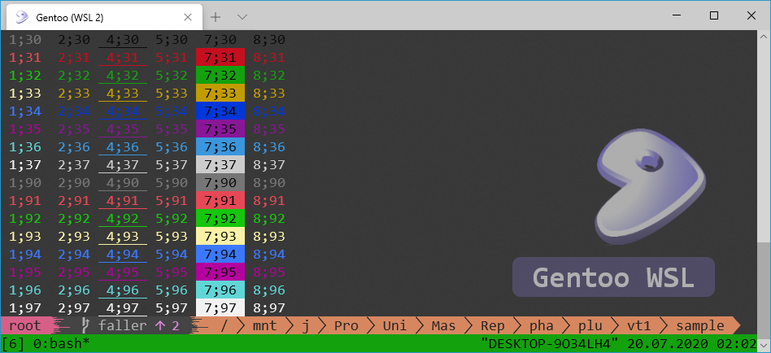

[](https://marketplace.visualstudio.com/items?itemName=Tobias-Faller.vt100-syntax-highlighting)
[](LICENSE.md)
[](https://github.com/TobiasFaller/vscode-vt100-syntax-highlight/releases)
[](https://github.com/TobiasFaller/vscode-vt100-syntax-highlight)
[](https://github.com/TobiasFaller/vscode-vt100-syntax-highlight/issues)
[](https://github.com/TobiasFaller/vscode-vt100-syntax-highlight/issues?q=is%3Aissue+is%3Aclosed)

Terminal Color and Style Highlighting for VS Code
=================================================

This extension provides highlighting for **terminal color** escape sequences in the editor.
The colors and styles can be customized via the configuration and light / dark theming is supported.
The included preview feature can be used to view the source file like it would be shown in a terminal.
With the export features the source file can be converted to text or to HTML.

Features
--------

- **Editor**: Color and styling support
- **Editor**: Snippets for escape sequences
- **Preview**: Terminal-like preview of the file
- **Export**: Text export with removed escape sequences
- **Export**: HTML export with rendered escape sequences

Below is a screenshot how the highlighted sample file might look by applying this plugin.
Select the file type "VT100 Terminal" on the lower right corner to enable highlighting of a file.







How to open the preview
-----------------------

Make sure that the extension is currently active for the selected file.
This is done by selecting the file type `VT100 Terminal` on the bottom right of the editor.
You can also use the `Change Language Mode` command, with has the shortcut `Ctrl + K` and then `M` when using the default configuration.
v
On the top right of the editor a preview icon with a magnifying glass should appear.
Click on this icon to open the preview.
You can also use the `Open Preview to Side` command, which has the shortcut `Ctrl + K` and then `V` when using the default configuration.



Extension Settings
------------------

Edit the global or workspace configuration and apply your custom colors.
The configuration values shown below are the default values set by the plugin.
All `foreground-color`, `background-color` and `attribute` settings support defining two styling variants.
The variant defined in the `editor` sub-configuration is used for the editor view, while the `preview` sub-configuration is used for the HTML preview.
If no sub-configurations are defined the style is used for both views.

All `color` and `background-color` options can be set to `native` to use the theme color when `vt100.use-native-theme` is set to `false`.
This can be used to selectively override single colors.

The native color theme currently does not work for HTML export (VS Code API limitation) and will use the colors for the preview option instead.

```jsonc
{
    // Associate the VT100 extension with *.log files if you want to.
    // "files.associations": {
    //     "*.log": "vt100"
    // },

    // Enable synchronous scrolling for preview when scrolling in the editor
    "vt100.synchronous-scrolling": true,

    // Enable native color theme support (overrides the user-defined colors)
    "vt100.use-native-theme": true,

    // Default foreground color and inverted default foreground color
    "vt100.foreground-color-default": {
        "dark": { "color": "#CCCCCC" },
        "light": { "color": "#333333"}
    },
    "vt100.foreground-color-inverted": {
        "dark": { "color": "#000000" },
        "light": { "color": "#FFFFFF"}
    },

    // Standard foreground colors
    "vt100.foreground-color-black": {
        "dark": { "color": "#666666" },
        "light": { "color": "#000000"}
    },
    "vt100.foreground-color-red": {
        "dark": { "color": "#CD3131" },
        "light": { "color": "#CD3131"}
    },
    "vt100.foreground-color-green": {
        "dark": { "color": "#0DBC79" },
        "light": { "color": "#00BC00"}
    },
    "vt100.foreground-color-yellow": {
        "dark": { "color": "#E5E510" },
        "light": { "color": "#949800"}
    },
    "vt100.foreground-color-blue": {
        "dark": { "color": "#2472C8" },
        "light": { "color": "#0451A5"}
    },
    "vt100.foreground-color-magenta": {
        "dark": { "color": "#BC3FBC" },
        "light": { "color": "#BC05BC"}
    },
    "vt100.foreground-color-cyan": {
        "dark": { "color": "#11A8CD" },
        "light": { "color": "#0598BC"}
    },
    "vt100.foreground-color-light-gray": {
        "dark": { "color": "#A5A5A5" },
        "light": { "color": "#777777"}
    },
    "vt100.foreground-color-dark-gray": {
        "dark": { "color": "#888888" },
        "light": { "color": "#555555"}
    },
    "vt100.foreground-color-light-red": {
        "dark": { "color": "#F14C4C" },
        "light": { "color": "#CD3131"}
    },
    "vt100.foreground-color-light-green": {
        "dark": { "color": "#23D18B" },
        "light": { "color": "#14CE14"}
    },
    "vt100.foreground-color-light-yellow": {
        "dark": { "color": "#F5F543" },
        "light": { "color": "#B5BA00"}
    },
    "vt100.foreground-color-light-blue": {
        "dark": { "color": "#3B8EEA" },
        "light": { "color": "#0451A5"}
    },
    "vt100.foreground-color-light-magenta": {
        "dark": { "color": "#D670D6" },
        "light": { "color": "#BC05BC"}
    },
    "vt100.foreground-color-light-cyan": {
        "dark": { "color": "#29B8DB" },
        "light": { "color": "#0598BC"}
    },
    "vt100.foreground-color-white": {
        "dark": { "color": "#E5E5E5" },
        "light": { "color": "#A5A5A5"}
    },

    // Default background color and inverted default background color
    "vt100.background-color-default": { },
    "vt100.background-color-inverted": {
        "dark": { "background-color": "#CCCCCC" },
        "light": { "background-color": "#333333"}
    },

    // Standard background colors
    "vt100.background-color-black": {
        "dark": { "background-color": "#000000" },
        "light": { "background-color": "#000000"}
    },
    "vt100.background-color-red": {
        "dark": { "background-color": "#CD3131" },
        "light": { "background-color": "#CD3131"}
    },
    "vt100.background-color-green": {
        "dark": { "background-color": "#0DBC79" },
        "light": { "background-color": "#00BC00"}
    },
    "vt100.background-color-yellow": {
        "dark": { "background-color": "#E5E510" },
        "light": { "background-color": "#949800"}
    },
    "vt100.background-color-blue": {
        "dark": { "background-color": "#2472C8" },
        "light": { "background-color": "#0451A5"}
    },
    "vt100.background-color-magenta": {
        "dark": { "background-color": "#BC3FBC" },
        "light": { "background-color": "#BC05BC"}
    },
    "vt100.background-color-cyan": {
        "dark": { "background-color": "#11A8CD" },
        "light": { "background-color": "#0598BC"}
    },
    "vt100.background-color-light-gray": {
        "dark": { "background-color": "#A5A5A5" },
        "light": { "background-color": "#777777"}
    },
    "vt100.background-color-dark-gray": {
        "dark": { "background-color": "#666666" },
        "light": { "background-color": "#555555"}
    },
    "vt100.background-color-light-red": {
        "dark": { "background-color": "#F14C4C" },
        "light": { "background-color": "#CD3131"}
    },
    "vt100.background-color-light-green": {
        "dark": { "background-color": "#23D18B" },
        "light": { "background-color": "#14CE14"}
    },
    "vt100.background-color-light-yellow": {
        "dark": { "background-color": "#F5F543" },
        "light": { "background-color": "#B5BA00"}
    },
    "vt100.background-color-light-blue": {
        "dark": { "background-color": "#3B8EEA" },
        "light": { "background-color": "#0451A5"}
    },
    "vt100.background-color-light-magenta": {
        "dark": { "background-color": "#D670D6" },
        "light": { "background-color": "#BC05BC"}
    },
    "vt100.background-color-light-cyan": {
        "dark": { "background-color": "#29B8DB" },
        "light": { "background-color": "#0598BC"}
    },
    "vt100.background-color-white": {
        "dark": { "background-color": "#E5E5E5" },
        "light": { "background-color": "#A5A5A5" }
    },

    // Separate style definitions for the editor and the preview panel are possible
    // "vt100.background-color-white": {
    //     "editor": {
    //         "dark": { "background-color": "#E5E5E5" },
    //         "light": { "background-color": "#A5A5A5" }
    //     },
    //     "preview": {
    //         "background-color": "#FFFFFF"
    //     }
    // },

    // VT100 attributes
    "vt100.attribute-bold": { "font-weight": "bold" },
    "vt100.attribute-dim": { "opacity": "0.7", "font-weight": "lighter" },
    "vt100.attribute-underlined": { "text-decoration": "underline solid" },
    "vt100.attribute-blink": {
        // The configuration for the editor and the preview is different,
        // because the editor does not support all CSS options.
        "editor": {
            "border": "1px dotted #FFFFFF77"
        },
        "preview": {
            // The animation is defined in the default custom CSS setting
            // for the preview.
            "animation": "blink-animation 1s step-start 0s infinite"
        }
    },
    "vt100.attribute-inverted": { },
    "vt100.attribute-hidden": { "opacity": "0.3" },

    // VT100 escape sequences
    // Do not apply additional styling to escape sequences (default).
    "vt100.escape-sequence": { },

    // Style for all text which is not an escape sequence.
    "vt100.text": { },

    // Make escape sequences white and fully visible in the editor.
    // Escape sequences are never rendered in the preview.
    // "vt100.escape-sequence": { "color": "#FFFFFF !important", "opacity": "1.0 !important"  },

    // Make escape sequences invisible in the editor.
    // "vt100.escape-sequence": { "opacity": "0.0 !important" },

    // Use the default editor font settings.
    "vt100.font-family": null,
    "vt100.font-size": null,
    "vt100.font-weight": null,

    // Use a different font for the preview.
    // Be sure to surround names with spaces in quotes.
    // "vt100.font-family": "'Lucida Console', monospace",

    // Additional custom CSS which is required for the preview.
    // The keyframes are required when animating the blinking style.
    // Use the classes .vscode-light, .vscode-dark and .vscode-high-contrast
    // to create theme dependent styles.
    "vt100.custom-css": {
        "*": {
            "padding": "0px",
            "margin": "0px"
        },
        ".bg": {
            "display": "inline-block",
            "padding": "0.1em"
        },
        "@keyframes blink-animation": {
            "50%": {
                "opacity": "0.0"
            }
        }
        // Example for dark theme only definition, which uses white text
        // when viewing in dark mode.
        // The same effect can be created by using the "dark" and "light"
        // settings of the other configuration options.
        //".vscode-dark .bg": {
        //  "color": "white"
        //}
    }
}
```

The HTML preview allows all [CSS properties](https://www.w3schools.com/cssref/default.asp) which can be set for a `span` element.
The [common properties](https://code.visualstudio.com/api/references/vscode-api#DecorationRenderOptions) listed below are supported by the editor view.
The HTML property names are automatically converted to the VS Code internal format which allows one value to be used for both configurations variants.
Even though the color configuration settings are called `foreground-color-*` and `background-color-*`, all properties below can be specified in the editor, if desired.

- **text-decoration**
- **outline-width**
- **outline-style**
- **outline-color**
- **outline**
- **opacity**
- **letter-spacing**
- **font-weight**
- **font-style**
- **cursor**
- **color**
- **border-width**
- **border-style**
- **border-spacing**
- **border-radius**
- **border-color**
- **border**
- **before**
- **background-color**
- **after**

The HTML preview uses the HTML class names in abbreviated form to reduce the memory consumption of the generated HTML code.
Below is the list with all class names and the abbreviations which are used in the HTML code.

- **foreground**: fg
- **foreground-color-default**: fg-de
- **foreground-color-inverted**: fg-in
- **foreground-color-black**: fg-bl
- **foreground-color-red**: fg-re
- **foreground-color-green**: fg-gr
- **foreground-color-yellow**: fg-yl
- **foreground-color-blue**: fg-blu
- **foreground-color-magenta**: fg-mg
- **foreground-color-cyan**: fg-cy
- **foreground-color-light-gray**: fg-lg
- **foreground-color-dark-gray**: fg-dg
- **foreground-color-light-red**: fg-lr
- **foreground-color-light-green**: fg-lgr
- **foreground-color-light-yellow**: fg-ly
- **foreground-color-light-blue**: fg-lb
- **foreground-color-light-magenta**: fg-lm
- **foreground-color-light-cyan**: fg-lc
- **foreground-color-white**: fg-wh
- **background**: bg
- **background-color-default**: bg-de
- **background-color-inverted**: bg-in
- **background-color-black**: bg-bl
- **background-color-red**: bg-re
- **background-color-green**: bg-gr
- **background-color-yellow**: bg-yl
- **background-color-blue**: bg-blu
- **background-color-magenta**: bg-mg
- **background-color-cyan**: bg-cy
- **background-color-light-gray**: bg-lg
- **background-color-dark-gray**: bg-dg
- **background-color-light-red**: bg-lr
- **background-color-light-green**: bg-lgr
- **background-color-light-yellow**: bg-ly
- **background-color-light-blue**: bg-lb
- **background-color-light-magenta**: bg-lm
- **background-color-light-cyan**: bg-lc
- **background-color-white**: bg-wh
- **attribute-bold**: at-bo
- **attribute-dim**: at-di
- **attribute-underlined**: at-ul
- **attribute-blink**: at-bl
- **attribute-inverted**: at-in
- **attribute-hidden**: at-hi
- **text**: te
- **escape-sequence**: es

Test the Extension with an Example
----------------------------------

Use the python program below to generate a sample file which contains VT100 escape sequences.

```python
#!/bin/env python3

FGCOLORS = [
    39,
    30, 31, 32, 33, 34, 35, 36, 37,
    90, 91, 92, 93, 94, 95, 96, 97
]
BGCOLORS = [
    49,
    40, 41, 42, 43, 44, 45, 46, 47,
    100, 101, 102, 103, 104, 105, 106, 107
]
ATTRIBUTES = [ 0, 1, 2, 4, 5, 7, 8 ]

for bgColor in BGCOLORS:
    for fgColor in FGCOLORS:
        line = ""
        for attribute in ATTRIBUTES:
            style = f"{attribute};{fgColor};{bgColor}"
            line += f"\x1b[0;{style}m {style}"
        line += "\x1b[0m"
        print(line)
    print()
```

Run the program with `python3 generate_sample.py > sample.vt100`.
The output looks similar to the image shown below on a terminal.



Requirements for Build
----------------------

Typescript for plugin development.
This extension does not need any other dependencies.

```bash
#!/bin/bash

# Install dependencies
npm install

# Build plugin
vsce package
```
